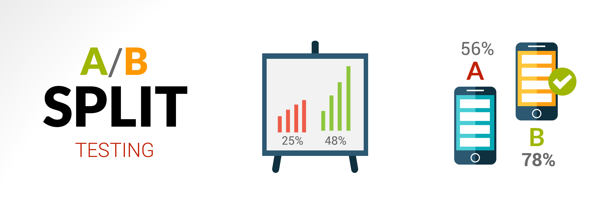

  [![MIT License][license-shield]][license-url]
  [![LinkedIn][linkedin-shield]][linkedin-url]

<br />

<p align="center">

  <a href="https://github.com/jtourkis/AB_Testing">
    
  </a>
  
 <a href="https://www.freepik.com/vectors/business">Business vector created by macrovector - www.freepik.com</a>
 
  <h3 align="center">AB Testing & Randomized Evaluation</h3>

  <p align="center">
    The goal of this repository is to explore different methods of AB Testing Marketing or Product Changes to determine their effectiveness.
    <br />
    <a href="https://github.com/jtourkis/AB_Testing"><strong>Explore the docs »</strong></a>
    <br />
    <br />
    <a href="https://github.com/jtourkis/AB_Testing">View Demo</a>
    ·
    <a href="https://github.com/jtourkis/AB_Testing/issues">Report Bug</a>
    ·
    <a href="https://github.com/jtourkis/AB_Testing/issues">Request Feature</a>
  </p>
</p>


<!-- TABLE OF CONTENTS -->
## Table of Contents

* [About the Project](#about-the-project)
  * [Built With](#built-with)
* [Getting Started](#getting-started)
  * [Prerequisites](#prerequisites)
  * [Installation](#installation)
* [Usage](#usage)
* [Roadmap](#roadmap)
* [Contributing](#contributing)
* [License](#license)
* [Contact](#contact)
* [Acknowledgements](#acknowledgements)


<!-- ABOUT THE PROJECT -->
## About The Project

The project uses data from Kaggle to simulate performing an AB Test or Randomized Evaluation. 

### Built With

* [Python](https://www.python.org) / [Jupyter Notebook](https://jupyter.org)


<!-- GETTING STARTED -->
## Getting Started

To get a local copy up and running follow these simple steps.

### Prerequisites

List of required packages.

* pandas

* numpy

* seaborn

* matplotlib.pyplot

* scipy


### Installation
 
1. Clone the repo

```sh
git clone https://github.com/jtourkis/AB_Testing.git
```
2. Install packages
```sh
install.packages()
```


<!-- USAGE EXAMPLES -->
## Usage

Use this space to show useful examples of how a project can be used. Additional screenshots, code examples and demos work well in this space. You may also link to more resources.

_For more examples, please refer to the [Documentation](https://example.com)_


<!-- ROADMAP -->
## Roadmap
AB Test Methods Used:
1. Two Sample T Test Bernoulli Distribution
2. Boot Strapping: T Testing a Sampling Distribution


See the [open issues](https://github.com/github_username/repo/issues) for a list of proposed features (and known issues).


<!-- CONTRIBUTING -->
## Contributing

Contributions are what make the open source community such an amazing place to be learn, inspire, and create. Any contributions you make are **greatly appreciated**.

1. Fork the Project
2. Create your Feature Branch (`git checkout -b feature/AmazingFeature`)
3. Commit your Changes (`git commit -m 'Add some AmazingFeature'`)
4. Push to the Branch (`git push origin feature/AmazingFeature`)
5. Open a Pull Request


<!-- LICENSE -->
## License

Distributed under the MIT License. See `LICENSE` for more information.

Note: The intial README Template was distributed under the MIT License. Copyright (c) 2018 Othneil Drew. [LICENSE](https://github.com/othneildrew/Best-README-Template/blob/master/LICENSE.txt)  for more information. 


<!-- CONTACT -->
## Contact

James Tourkistas - jmtourkistas@suffolk.edu

Project Link: [https://github.com/jtourkis/AB_Testing](https://github.com/jtourkis/AB_Testing)


<!-- ACKNOWLEDGEMENTS -->
## Acknowledgements

* [Best-README-Template](https://github.com/othneildrew/Best-README-Template/blob/master/BLANK_README.md) 
* [Sales-Conversion-Optimization-Dataset](https://www.kaggle.com/loveall/clicks-conversion-tracking)
* [Art-of-AB-Testing](https://towardsdatascience.com/the-art-of-a-b-testing-5a10c9bb70a4) 
* [Master-Your-Hypothesis-Test](https://towardsdatascience.com/master-your-hypothesis-test-a-tutorial-on-power-bootstrapping-sample-selection-and-outcome-273d6739d3e5) 
* [AB-Image-Creator](https://www.freepik.com/vectors/business)


<!-- MARKDOWN LINKS & IMAGES -->
<!-- https://www.markdownguide.org/basic-syntax/#reference-style-links -->
[license-shield]: https://img.shields.io/github/license/othneildrew/Best-README-Template.svg?style=flat-square
[license-url]: https://github.com/jtourkis/MBTA-Ridership-Model/blob/master/LICENSE.txt
[linkedin-shield]: https://img.shields.io/badge/-LinkedIn-black.svg?style=flat-square&logo=linkedin&colorB=555
[linkedin-url]: https://www.linkedin.com/in/james-tourkistas-7127ba167/
[product-screenshot]: images/screenshot.png
